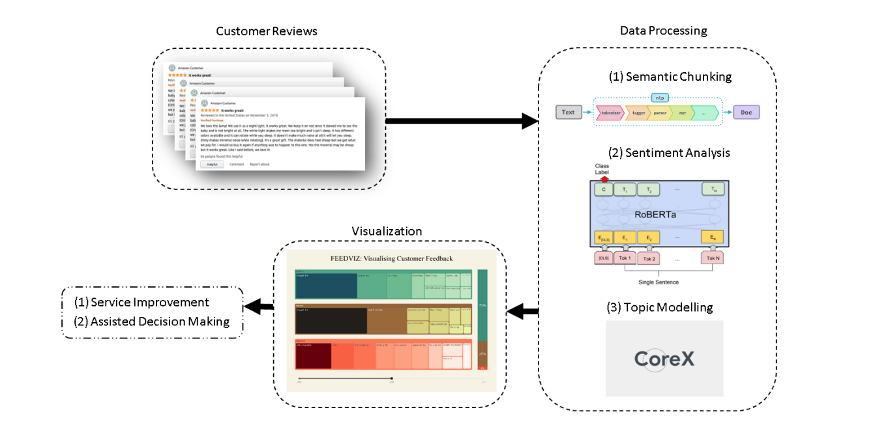

# FeedVis: Visualizing Automated Insights from Customer Feedback through NLP Techniques
This repository contains the code and notebook results for [This Paper](https://drive.google.com/file/d/1uOciLkDEhlTxlAaQrGSRSoF1_VjviHY6/view?usp=sharing) on Visualization of Customer Feedbacks.

## Introduction
This research presents FeedViz, an automated system for analyzing and visualizing customer feedback using advanced Natural Language Processing (NLP). It follows a four-step approach: Semantic Chunking with SpaCy, Sentiment Analysis using Twitter-roBERTa-base, Topic Modeling with CorEx, and an Interactive Visualization dashboard built with Dash and Plotly. FeedViz enables stakeholders to explore sentiment-specific treemaps, bar graphs, and trend histograms, streamlining customer feedback analysis for improved product quality and business performance.

